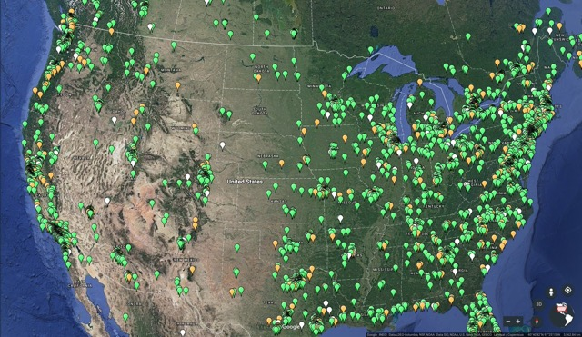
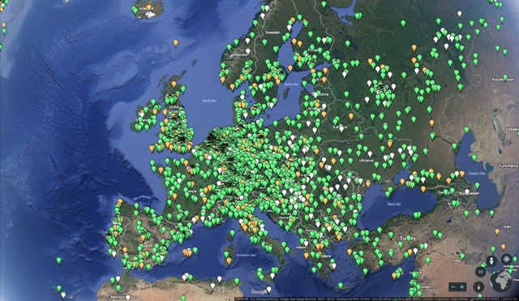

### Étude de la consommation énergétique des Smart contracts dans la blockchain Ethereum
##### Jean-Patrick Gelas, Hayri Acar, Hind Benfenatki
##### Université Lyon 1/LIRIS/INRIA/ENS Lyon

##### Entretiens Jacques Cartier, 12-13 novembre 2018, ENS Lyon

---

### $ who am i

```JSON
{
	"first_name" : "Jean-Patrick",
	"last_name" : "Gelas",
	"job" : "Assistant Professor",
	"locations" : [ "Université Claude Bernard - Lyon 1",
			"Avalon/INRIA/ENS Lyon" ],
	"github" : "https://github.com/jpgelas",
	"url" : "https://perso.univ-lyon1.fr/jean-patrick.gelas",
	"email" : "jean-patrick.gelas@univ-lyon1.fr"
}
```

---

### Agenda

On ne parlera pas de ...

@ul
 - Algorithmes de consensus (PoW, PoS, ...)
 - Minage	
 - Merkle trees
 - Comment devenir un crypto millionaire ! :-)
@ulend
 
---

### Objectifs
 
 - Bref rappels (Blochain, Mineurs, ...)
 - Introduction aux Smart Contracts de la blockchain Ethereum : 
   - Création, déploiement, usage, fonctionnement.
 -  

---

### Rappels

 - Blockchain : Structure de données simple 
 - La technologie Blockchain : « Base de données » sécurisées et décentralisées. 
 - Les mineurs :  
   - génèrent de nouveaux coins (par rétribution), 
   - vérifient l’intégrité de la blockchain,
   - ajoutent de nouvelles liste de transaction (des blocs) à la chaine.

 - Mining ether = Securing the network = Verifying computation

---
### L’infrastructure Ethereum
25000 nœuds contre 7000 pour Bitcoin (31/5/2017)
<br>
 


--- 

### Questions ?

Cette présentation est disponible sur https://gitpitch.com/jpgelas/EJC


