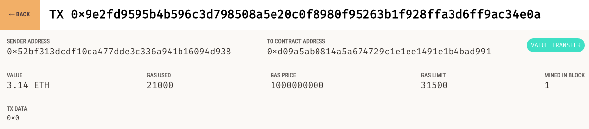

### Étude de la consommation énergétique des Smart contracts dans la blockchain Ethereum
<br>
Jean-Patrick Gelas, Hayri Acar, Hind Benfenatki
<br>
Université Lyon 1/LIRIS/INRIA/ENS Lyon
<br>
<br>
@size[0.8em](Entretiens Jacques Cartier, 12-13 novembre 2018, ENS Lyon)

---
@snap[north-west span-50]
@size[1.3em](`jp@ejc2018:~$` @color[blue](`whoami`))
@snapend

@snap[north-east logo]

@snapend
<br><br>
```JSON
{
	"first_name" : "Jean-Patrick",
	"last_name" : "Gelas",
	"job" : "Assistant Professor",
	"locations" : [ "Université Claude Bernard - Lyon 1",
			"Avalon/INRIA/ENS Lyon" ],
	"url" : "https://perso.univ-lyon1.fr/jean-patrick.gelas",
	"email" : "jean-patrick.gelas@univ-lyon1.fr",
	"github" : "https://github.com/jpgelas",
	"hobbies" : [ "skydive", "wingsuit" ]
}
```
---

### Agenda

On ne parlera pas de ...

@ul
 - Cryptographie, Hash, Merkle tree,...
 - Algorithmes de consensus (PoW, PoS, DPoS,...)
 - Plateformes d'échanges
 - Comment miner de la crypto monnaie	
 - Comment devenir @color[red](crypto millionaire) ! @fa[smile-o fa-1x]
@ulend
 
+++
### Comparatif


<br/>
https://blog.picks.co/pow-is-efficient-aa3d442754d3

---

### Objectifs
 
 - Rappels (Blockchain, Mineurs, ...)
 - Introduction à la blockchain **Ethereum**
 - Les Smart Contracts : Création, déploiement, fonctionnement.
 - Modélisation et maîtrise de leur consommation.
 

---

### Blockchain


 - Blockchain : Structure de données simple 
 - La technologie Blockchain : « Base de données » sécurisées et décentralisées. 

@snap[south-east]
@size[0.5em](Démo : https://anders.com/blockchain/)
@snapend


---

### Les mineurs

@snap[south-east logo]

@snapend

  - Héberge une copie de la blockchain
  - Ajoutent de nouvelles liste de transactions (*i.e.* des blocs) à la chaîne.
  - Vérifient l’intégrité de la blockchain
  - Génèrent de nouveaux *coins* 
  - (Exécutent les Smart Contracts) 

Note:
  - Génèrent de nouveaux *coins* (par rétribution)

---

### Ethereum
@snap[north-east logoeth]

@snapend

@quote[Protocole d'échanges décentralisés permettant la création par les utilisateurs de contrats intelligents grâce à un langage Turing-complet.](Wikipedia)

---

### Ethereum
@snap[north-east logoeth]

@snapend

  - Blockchain de *seconde génération*
  - Développée par *Vitalik Buterin*, lancée en juillet 2015.
  - Fréquence moyenne des blocs : 14-15 secondes
  - Taille des blocs : dynamique
  - Symbole boursier : *ETH*
  - Quantité maximale : non limitée

Note:
  - Vitalin et aussi Gavin Wood, Joseph Lubin

---
@snap[north-west span-100]
@size[1.3em](L’infrastructure Ethereum)
<br>
@size[0.5em](27500 nœuds contre 7000 pour Bitcoin)
@snapend

@snap[west ethermap]

@snapend

@snap[east ethermap]

@snapend

@snap[south span-100]
@size[0.3em](Source: https://twitter.com/peter_szilagyi/status/887272506914213888 - 18/07/2017)
@snapend

Note:
  - 7000 pour Bitcoin (31/5/2017)
  - green = @golang geth, 
  - orange = @rustlang parity, 
  - white = everything else.


---?image=images/Ethernodes.org.2018-10-28.png&size=contain
@title[Ethernodes (web)]

@snap[west span-30]
@size[0.3em](https://www.ethernodes.org)
@snapend

--- 

### Smart Contract

@snap[north-east logoeth]

@snapend

 - Programme autonome
 - Déployé et répliqué 
 - Non modifiable
 - Adapté pour gérer des transactions

Note: 
  - Programme autonome qui exécute automatiquement des conditions définies au
    préalable et inscrites dans la blockchain.
  - Déployé et répliqué sur la même infrastructure de calcul qui héberge et
    mine la blockchain Ethereum.
  - Résultat de l'exécution déterministe.
 
---

### Smart Contract @size[0.3em](_suite_)

@snap[north-east logoeth]

@snapend

 - Du *bytecode* stocké dans la blockchain
 - Rédigé dans un langage de haut niveau : *Solidity*
 - Compilé (*solc*)
 - Accessible via une adresse codée sur *160 bits*
 - Exécuté dans l'*Ethereum Virtual Machine* (EVM)
<br/>
<br/>
0x71c7656ec7ab88b098defb751b7401b5f6d8976f

Note:
 - ou rédigé en Serpent, Viper, LLL,...)

---
### Code Machine 

```
"opcodes": "PUSH1 0x80 PUSH1 0x40 MSTORE
CALLVALUE DUP1 ISZERO PUSH2 0x10 JUMPI PUSH1 0x0
DUP1 REVERT JUMPDEST POP PUSH1 0x40 MLOAD PUSH1 
0x20 DUP1 PUSH2 0x487 DUP4 CODECOPY DUP2 ADD 
PUSH1 0x40 SWAP1 DUP2 MSTORE SWAP1 MLOAD PUSH1..." 
"object":
"608060405234801561001057600080fd5b5060405160
208061048783398101604090815290516000805460016
0a060020a0319163317808255600160a060020a031681
52600160208190529290209190915560ff81166100606..."
```
---

#### Le langage Solidity

@snap[north-east logoeth]

@snapend

 - Langage de haut niveau
 - influencé par C++, Python et Javascript.
 - Typé statiquement.
 - Supporte l'héritage,
 - l'appel à des bibliothèques,
 - la définition de type complexe par les utilisateurs.

---
### Hello world

```
pragma solidity ^0.4.18;
contract Hello {
    string message = "Default message";

    function getMessage () public view returns (string) {
        return message;
    }
    function setMessage (string _message) public payable {
        message = _message;
    }
}
```


---
### 0x (ZRX) token (ERC-20)
```
contract ZRXToken is UnlimitedAllowanceToken {

    uint8 constant public decimals = 18;
    uint public totalSupply = 10**27; // 1 billion tokens, 18 decimal places
    string constant public name = "0x Protocol Token";
    string constant public symbol = "ZRX";

    function ZRXToken() {
        balances[msg.sender] = totalSupply;
...
```

---
### Nexium (NxC) token (ERC-20)
```
contract Nexium { 
	...
	function Nexium() {
		initialSupply = 100000000000;
		balanceOf[msg.sender] = initialSupply;
		name = 'Nexium';
		symbol = 'NxC';
		decimals = 3;
		burnAddress = 0x1b32000000000000000000000000000000000000;
	}
	function totalSupply() returns(uint){
		return initialSupply - balanceOf[burnAddress];
	}
	function transfer(address _to, uint256 _value) ...
	function transferFrom(address _from, ...
```
@snap[south-east span-40]
@size[0.3em](http://b2expand.com/nexium-token)
@snapend

---
### Ethereum Virtual Machine


---

### Ethereum Virtual Machine

 - Machine (quasi-) Turing complete.
 - Environnement d'exécution des Smart Contracts
 - Émule une machine *256 bits* avec des pseudo-registres
 - Registres émulés par une *stack* virtuel

Note:
  - In computing, a machine is said to be Turing complete if it can solve any
    problem that a Turing machine can, given an appropriate algorithm, the necessary time and memory.
  - Pour l'EVM le paramètre limitant est le GAS.
  - https://www.mayowatudonu.com/blockchain/deep-dive-into-evm-intro


---

### Ethereum et unités de mesure

 - **Ether** (ETH) : le nom de la crypto monnaie
 - **Wei** : une fraction d'Ether (1 ETH = 10<sup>18</sup> Wei)
 - **GAS** : unité de mesure en terme de quantité de calcul 
 - **GAS price** : défini le prix (en GWei) que vous êtes prêt à payer au mineur.
 - **GAS limit** : Quantité maximum de gas que vous êtes prêt à payer pour une transaction.
 
---

### Analogie

  - *GAS limit* : capacité du réservoir d'une voiture en litre. 
  - *GAS price* le prix du litre de carburant.
    - Voiture : 1,50 EUR (prix) par litre (unité)
    - Ethereum : 20 GWei (prix) par GAS (unité)

  - Pour remplir le réservoir il faut :
    - 50 litres à 1,50 EUR = 75 EUR
    - 21000 unités de GAS à 20 GWei = 0.00042 ETH 

---

### Remarques

 - Fixer un *GAS limit* évite de dépenser une fortune en cas de problème. 
 - La quantité de GAS requise est définie par la quantité d'instructions exécutées.
 - Fixer un *GAS limit* trop petit a peu d'intérêt.

Note: 
 - https://kb.myetherwallet.com/gas/what-is-gas-ethereum.html   
 - Ex: boucle infinie.

---

### Coût des instructions 


Note: 
 - Limite de GAS par bloc : 8 000 000 GAS
 - Lu ailleur : 4 700 000 gas/block (28/juin/2017)
 - Transaction simple : 21000 GAS

---

### Coût d'une transaction

 - Coût total d'une transaction = *GAS_price &ast; GAS_used*
 - Priorité aux transactions avec un *GAS_price* élevé.
 - Plus l'utilisateur est prêt à payer, plus vite la transaction sera traitée.
 

Note:
  - Les mineurs donnent priorités aux transaction avec un GAS price élevé.

---?image=images/tx_pool_infographic.png&size=contain
@title[MyEtherWallet]

@snap[east span-30]
@size[0.3em](https://www.myetherwallet.com)
@snapend

---?image=images/ethgasstation-10.2018.png&size=contain
@title[EthGasStation (web)]

Note:
  - Calcul du GAS price moyen sur les 1500 derniers blocs (+ de 6h)

---?image=images/chart.png&size=contain
@title[Ethereum blocks usage]

---

### Performances actuelles 

 - **block time 15 sec**, 4 blocks/min
 - 5959 block/day, 2 174 897 block/year  
 - **Block Gas limit 8 000 000**
 - Daily Gas cap 47 668 965 517
 - 76 364 avg gas/tx 
 - 624 236 tx/day cap  
 - 433 tx/min
 - **7 tx/sec**

Note:
  - VISA annonce 24000 tx/sec -> 1700 en réalité
  - Shasper annonce 13410 tx/sec !!! (Casper + Sharding)

---

### En résumé : Pour le calcul...

  - L'infrastructure Ethereum est un énorme ordinateur Turing complet distribué
  - Ultra tolérant aux pannes
  - Trés mal exploité car tous les noeuds exécutent les mêmes instructions avec les même données @fa[meh-o fa-1x]


---

### En résumé : Pour le stockage...

  Par conception on est limité par :  
  - la capacité de stockage des noeuds
  - le débit (90 kB / 15 sec => 50 kbits/s)
  - le prix du GAS qui fluctue en fonction de l'Ether
  - *SSTORE* : 20.000 GAS/Word -> 640.000 GAS/KB
    - 3,5 GWei / GAS -> 0,00224 ETH/KB
    - 200 $/ETH -> 0,448 $/KB

Note:
 - On y stock le hash du fichier seulement (Proof-of-existence)
---

### 448 000 USD / GBytes
#### ~45 heures
(novembre 2018)

---?image=images/clark-howard_253013121.jpg&size=contain
@title[90's phones]


---

### Outils de développement

---

### Ganache


---
### Metamask
@snap[west ethermap]

@snapend

@snap[east ethermap]

@snapend

---
### Transaction


---

### Transaction  @size[0.3em](_détail_)


---?image=images/etherscan.png&size=contain
@title[Etherscan snapshot]

---?image=images/remix-snapshot.png&size=contain
@title[Remix snapshot]
### Remix 

---

### Conclusion

 - Miner de l'ether = Sécuriser le réseau = Vérifier les traitements
 - Par conception la blockchain Ethereum garantie :
   - l'immutabilité des données,
   - l'exécution et l'accès sans censure possible. 
 - Analyser un Smart Contract en terme de consommation de GAS pour maitriser le coût operationnel.
 - Maximiser les calculs et le stockage *offchain*.

---

### @fa[question-circle-o fa-1x] Questions @fa[question-circle-o fa-1x] 

Cette présentation est disponible sur https://gitpitch.com/jpgelas/EJC

@snap[south-east]
@size[0.5em](:wq!)
@snapend


---

### Liens utiles
@ul[list-long-items](false)
 - https://hackernoon.com/ether-purchase-power-df40a38c5a2f
 - OPCODE list + GAS : https://docs.google.com/spreadsheets/d/1m89CVujrQe5LAFJ8-YAUCcNK950dUzMQPMJBxRtGCqs/edit#gid=0
 - Ethernodes (28/10/2018 -> 13320 nodes) : https://www.ethernodes.org/network/1
 - https://www.etherchain.org/charts/averageBlockUtilization
 - https://etherscan.io/
 - https://medium.com/coinmonks/storing-on-ethereum-analyzing-the-costs-922d41d6b316
@ulend


